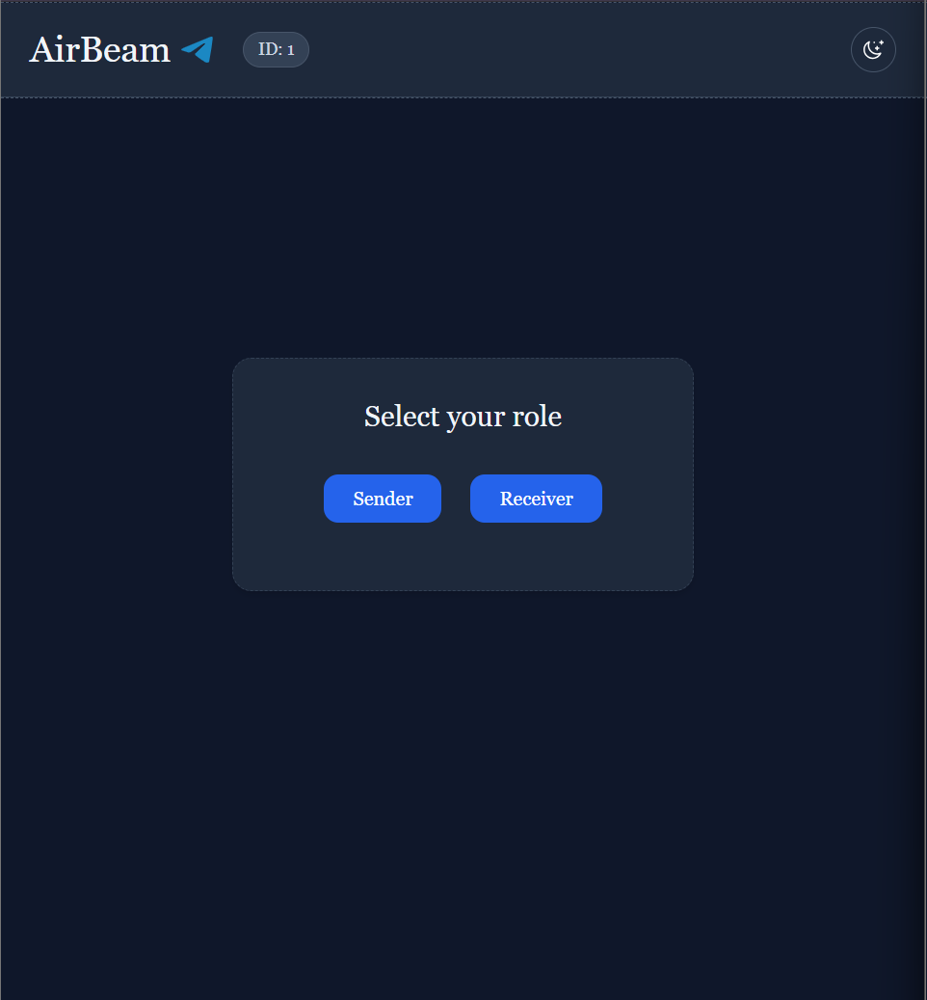
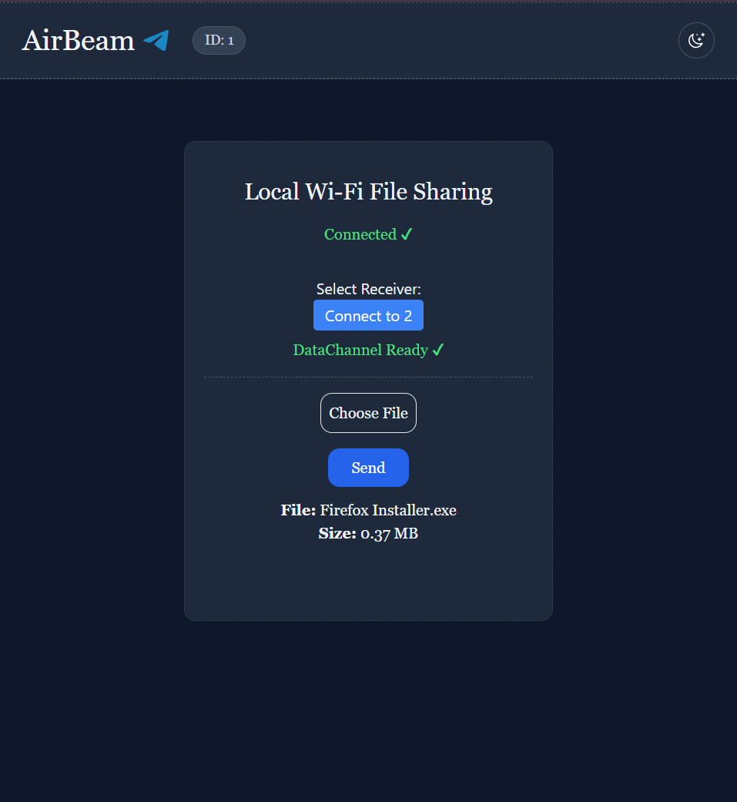
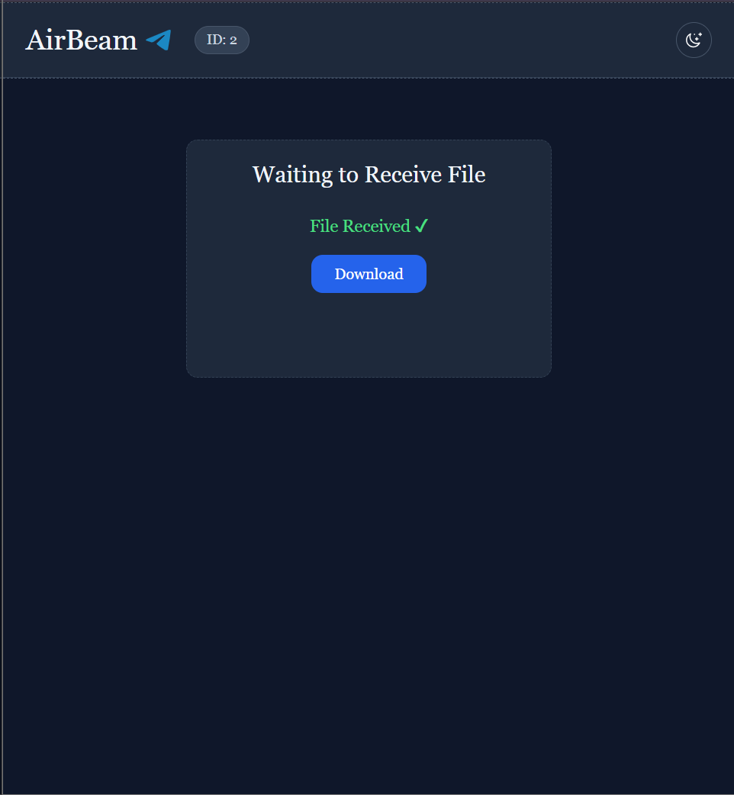
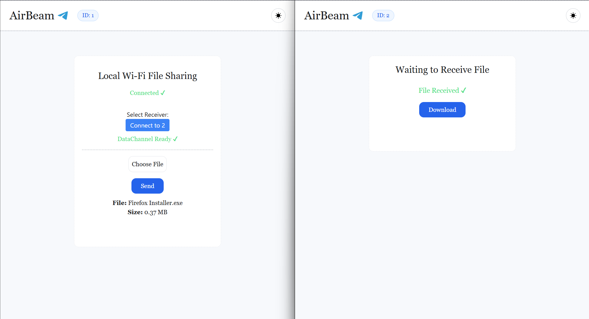

# 🌐 **AirBeam – Local Wi-Fi P2P File Sharing (WebRTC + WebSockets)**

AirBeam is a **local Wi-Fi peer-to-peer file sharing system** that allows two devices on the same network to transfer files **directly**, without the internet, cloud, or external servers.

It uses **WebRTC DataChannels** for fast P2P transfer and a lightweight **WebSocket signaling server** to set up the connection.

---

## ✨ **Features**

* ⚡ **Direct P2P file transfer** using WebRTC
* 📡 **Local Wi-Fi only — no internet required**
* 🔒 **Data never leaves your network**
* 🗂️ Supports **any file type**
* 🖥️ Clean, modern UI with **Dark/Light theme**
* 🔄 Real-time **Send/Receive progress bars**
* 🎚️ Choose between **Sender & Receiver roles**
* 👥 View **all connected devices** on the network
* 🚀 Built with **React (Vite) + Tailwind + Node.js + WebSockets**

---

## 📸 **Screenshots**

### 🔘 **Role Selection**

Choose whether you want to send or receive files.



---

### 📤 **Sender Interface**

Pick a file → connect to a receiver → send instantly.



---

### 📥 **Receiver Interface**

Wait for the incoming file chunks and download the reconstructed file.



---

### 🌗 **Theme Switching (Dark / Light Mode)**



---

## 🛠️ **Tech Stack**

### **Frontend**

* React + Vite
* Tailwind CSS
* WebRTC (RTCPeerConnection + DataChannel)
* Context API (Theme + Role)
* WebSocket client

### **Backend**

* Node.js
* WebSocket (`ws` package)
* Lightweight signaling server

---

## 📁 **Project Structure**

```
AIRBEAM/
│
├── backend/
│   ├── server.js
│   ├── package.json
│   └── package-lock.json
│
└── frontend/
    ├── public/
    ├── src/
    │   ├── assets/       # screenshots & icons
    │   ├── components/
    │   │   ├── Container.jsx
    │   │   ├── Receiver.jsx
    │   │   ├── Role.jsx
    │   │   ├── Header.jsx
    │   │   └── Border.jsx
    │   ├── context/
    │   │   ├── ThemeContext.jsx
    │   │   └── RoleContext.jsx
    │   ├── socket.jsx
    │   ├── App.jsx
    │   ├── main.jsx
    │   └── index.css
```

---

## ⚙️ **How It Works**

### **1️⃣ Signaling (WebSocket)**

* Sender & receiver connect to the signaling server
* Server assigns each client a unique **ID**
* Server broadcasts list of all connected clients
* Sender selects a receiver
* They exchange:

  * **Offer**
  * **Answer**
  * **ICE candidates**

---

### **2️⃣ WebRTC P2P Connection**

* Sender creates a **DataChannel**
* Receiver accepts via `ondatachannel`
* Once `dataChannel.readyState === "open"` → direct P2P connection

---

### **3️⃣ File Transfer**

* File is split into **16 KB chunks**
* Sender streams chunks over DataChannel
* Receiver rebuilds them → creates a final **Blob**
* Receiver downloads the file

💡 **Zero file data touches the backend — 100% P2P.**

---

## 🚀 **Running Locally**

### **Backend (Signaling Server)**

```bash
cd backend
npm install
node server.js
```


### **Frontend**

```bash
cd frontend
npm install
npm run dev
```

---

## 📱 **How to Use**

1. Open **AirBeam** on two devices connected to the same Wi-Fi
2. Choose role → **Sender** or **Receiver**
3. Sender selects a receiver from the list
4. Sender picks a file → clicks **Send**
5. Receiver views live progress
6. Receiver downloads the final file

---

## 🤝 **Contributing**

Contributions, issues, and feature requests are welcome!
Feel free to open a PR.

---

## 📜 **License**

MIT License © 2025

---